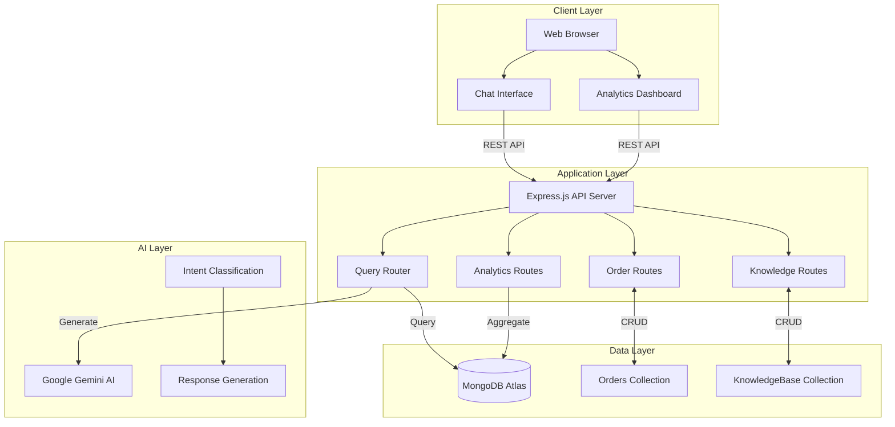
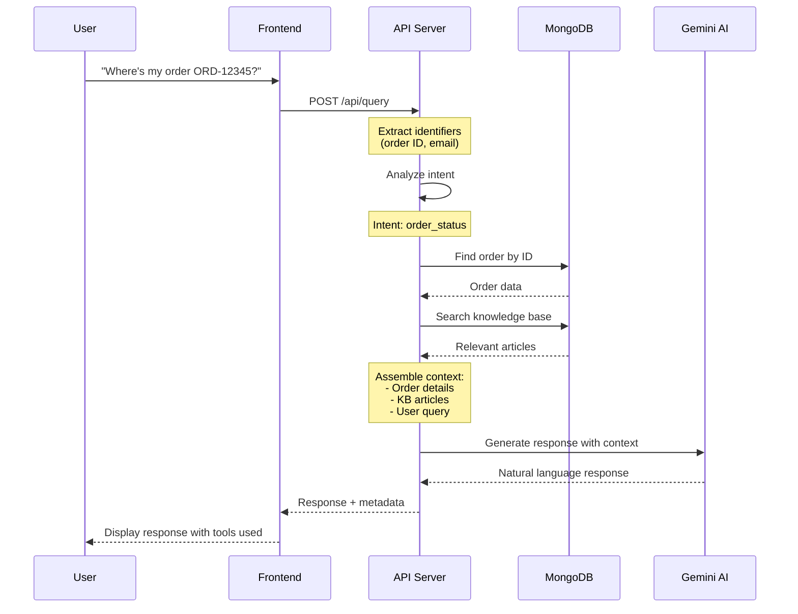
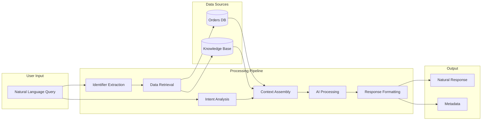
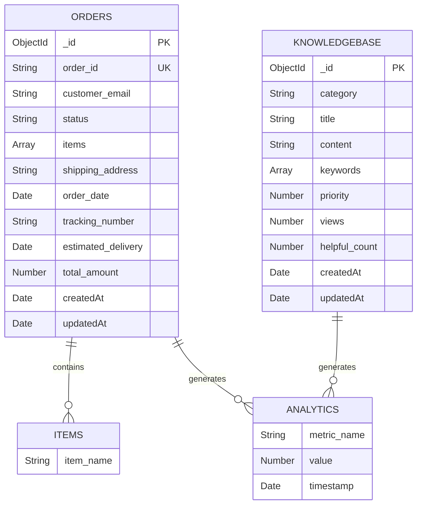
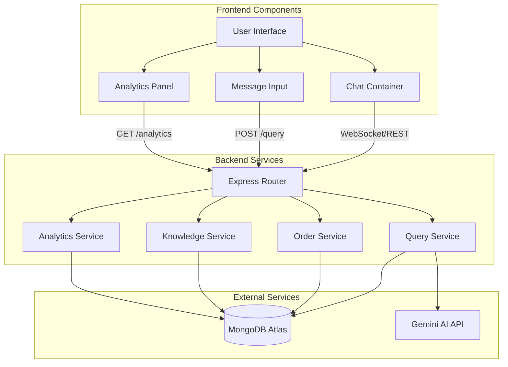
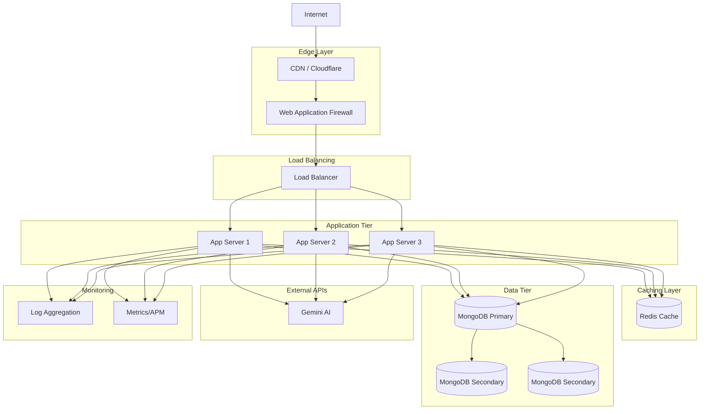
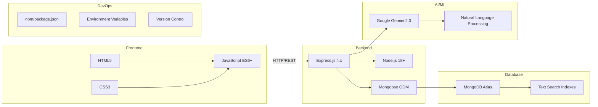
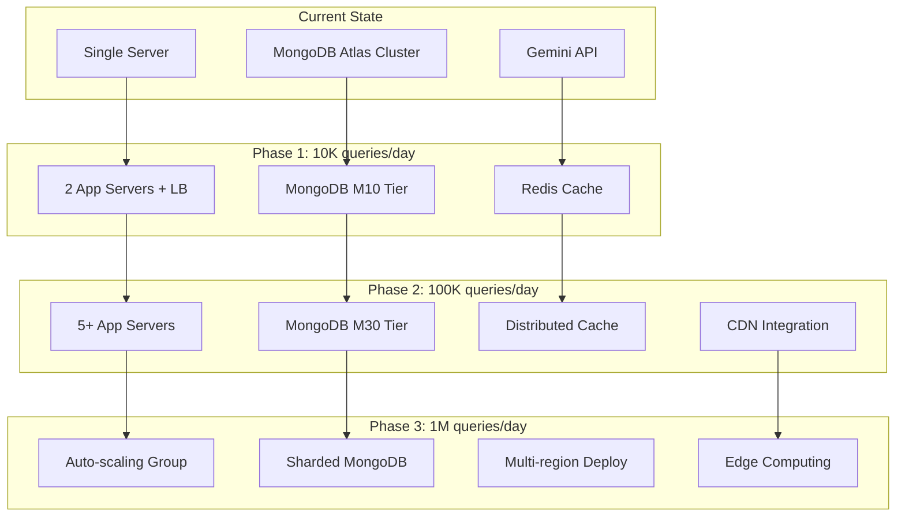

# System Architecture Diagrams

## High-Level Architecture

## Query Processing Flow

## Data Flow Architecture

## Database Schema

## System Components

## Deployment Architecture (Production)

## Technology Stack Visualization

## Scaling Strategy

